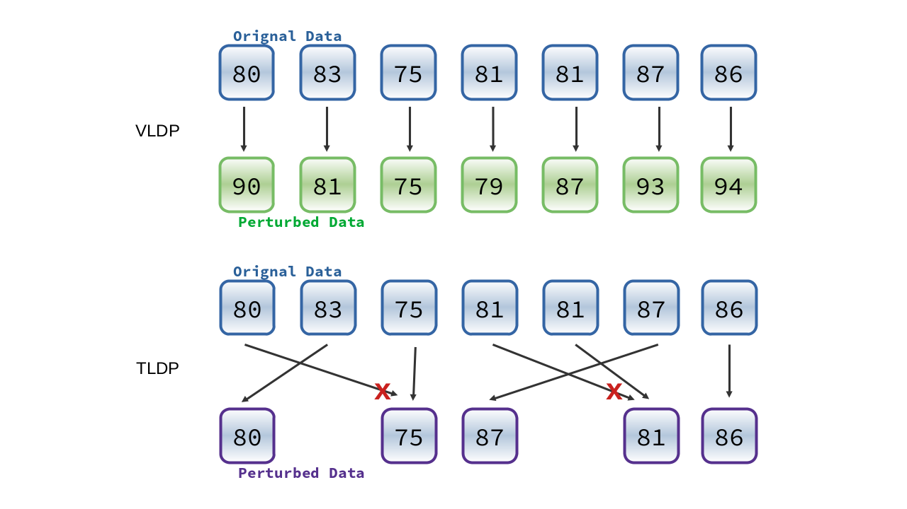
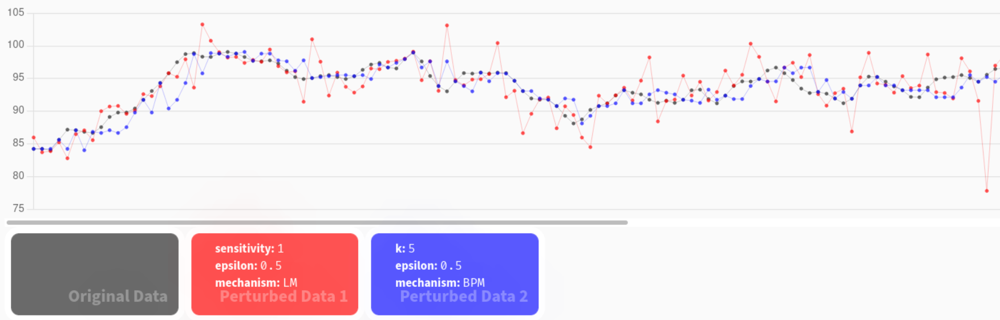
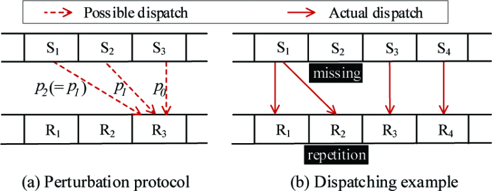
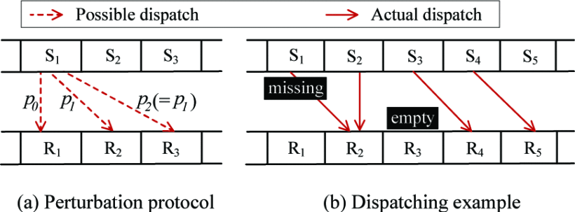
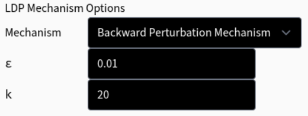

<!-- _paginate: false -->
<!-- _header: "" -->
<!-- _backgroundColor: "#eceff4"-->

EIE4430 Honours Project
Final Presentation

## Differentially Private Time Series Data Release

CHOW Lap Fung
20020215D

---

<!-- _footer: "Presentation Overview" -->

# Upcoming

-   Introduction
-   Methodology
-   Evaluation
-   Conclusion

---

<!-- footer: "Introduction" -->

# Background & Problem Description

- Data are important during the intelligent transformation in the industrial and academic sectors [1]
- Service providers collect user data 
  - improve services, features based on statistics
- Concerns of data privacy [2]
  - vulnerable to data breaches
- Time series data are closely related to personal data

---
### Examples of Time-series Data Consist of Personal Information [3]
-	IoT appliances for Smart home
-	Biometric sensor on wearables and health devices 
-	Location tracking

---
<!-- footer: "Background Knowledge" -->

# Local Differential Privacy (LDP)
- perturbs data the users' devices **locally** [2]
- the third party only gets the perturbed data
- original data would not be transferred outside the device
---

# Local Differential Privacy (LDP)

$$
\operatorname{Pr}[\mathcal{A}(v)=v^*] \le e^\epsilon \times \operatorname{Pr}[\mathcal{A}(v')=v^*]
$$

| Math Stuffs   | Description          |
| ------------- | -------------------- |
| $\Pr$         | Perturbation         |
| $\mathcal{A}$ | Randomized algorithm |
| $v, v'$       | Any two input values |
| $v*$          | Output value         |
| $\epsilon$    | Privacy Budget       |

---

# Local Differential Privacy (LDP)

---

# Local Differential Privacy (LDP)

---
# Local Differential Privacy (LDP)

---
<!-- footer: "Perturbation Mechanism" -->
# Perturbation Mechanism
- a randomized algorithm satisfies differential privacy
$$
\frac{\Pr[\mathcal{A}(x) = S]}{\Pr[\mathcal{A}(x') = S]}
\le e^\epsilon
$$

| Math Stuffs   | Description           |
| ------------- | --------------------- |
| $\Pr$         | Perturbation          |
| $\mathcal{A}$ | Randomized algorithm  |
| $x, x'$       | Neighboring datasets  |
| $S$           | Possible output value |
| $\epsilon$    | Privacy Budget        |
---
# Laplace Mechanism
> local differential privacy in the value setting
- add random noise from Laplace distribution

$$
\mathcal{A}(x) = x + \operatorname{Lap}(\frac{s}{\epsilon})
$$

| Math Stuffs | Description    |
| ----------- | -------------- |
| $x$         | Input value    |
| $s$         | Sensitivity    |
| $\epsilon$  | Privacy budget |

---
# Laplace Mechanism

---
# Local Differential Privacy in the Value Setting (VLDP)

---
# Time Series Data
- temporal data: a regular time interval
- indexed with a timestamp [3]

---
# Local Differential Privacy in the Temporal Setting (TLDP)
- Perturbing data with a randomized algorithm may cause significant distortion of the values in time-series data

---

# VLDP vs TLDP

  - Red: Laplace Mechanism `VLDP`
    -  $\epsilon = 0.5, \text{sensitivity} = 1$
  - Blue: Backward Perturbation Mechanism `TLDP`
    - $\epsilon = 0.5, k = 5$

---
<!-- footer: "Methodology" -->
# Implementation of TLDP
- **Backward Perturbation Mechanism**
- **Forward Perturbation Mechanism**
- Threshold Mechanism
---

# Backward Perturbation Mechanism
- release a drawn value from the **previous** $k$ time timestamps
- **output-driven**

---
# Probabilities satisfying $\epsilon$-LDP
$$
\Pr (P_i = S_{i-j}) := p_j = 
\begin{cases}
\dfrac{e^{\epsilon/2}}{k-1+e^{\epsilon/2}}, && j=0 \\
\dfrac{1}{k-1+e^{\epsilon/2}}, && j \in \{ 1, 2, \cdots, k-1  \}
\end{cases}
$$

---
# Forward Perturbation Mechanism
- dispatch each data in the **following** $k$ timestamps
- **input-driven**

---

### Missing costs in Backward / Forward Perturbation Mechanism
- due to repeatedly selecting from / dispatching the value to the same timestamp

---

# Threshold Mechanism
- reduced the missing cost of Backward / Forward Perturbation Mechanism
- add the rule to the collision-free Forward Perturbation Mechanism
---
# Threshold Mechanism
- windows size k and threshold
- value of threshold should be in the range from 2 to k – 1
- if the number of empty slots in the current window is greater than the threshold, the data would be dispatched randomly to an empty slot of the window
- Otherwise, if the number of empty slots is less than or equal to the threshold, and the current slot of the perturbed data sequence is empty, the data would be dispatch to this slot

---
# Extended Threshold Mechanism
- to configure the mechanism with the privacy budget ϵ instead of the threshold
-  calculate the derived privacy budget ϵ ̂ for the possible thresholds
-  optimal threshold is found
   -  Threshold Mechanism with optimal threshold
-  optimal threshold is NOT found
   -  Extended Perturbation would be applied

---
<!-- footer: "Methodology" -->

---
# Development Stack
| Tool                  | Description                 |      |
| --------------------- | --------------------------- | ---- |
| **Node.Js**           | runtime environment         | [5]  |
| **Electron**          | application framework       | [6]  |
| **React**             | building user interface     | [7]  |
| **Tailwind CSS**      | styling                     | [8]  |
| **Chart.js**          | creating charts             | [9]  |
| **Simple Statistics** | statistics implementations | [10] |

---
# User Interface
 

---
# Data and parameter inputs
 
- a text file with the format of each datum at a line

---
# Data and parameter inputs
 

---
# Chart Presentation

---
# Data List

---
<!-- footer: "Evaluation" -->
# Data Sources
- Heart rate time series from MIT-BIH Database Distribution
- Datasets from UC Irvine Machine Learning Repository

---
# Privacy Budget $\epsilon$
- indicates the degree of privacy preserved 
after the perturbation is implemented
- lower value of introduces more randomization
- resulting dataset would be more different from original dataset
- &darr;$\epsilon$ $=$  &uarr; privacy preservation

---
<!-- _footer: "" -->
<!-- _header: "EIE4430 Honours Project &emsp; _Interim Presentation_ \n **Differentially Private Time Series Data Release** \n These results are obtained with the heart rate dataset \n with Backward Perturbation Mechanism and **window size of 20**." -->

$\epsilon = 1$

$\epsilon = 5$

$\epsilon = 10$

---

# Window size $k$
- greater than 1 
- the output are drawn from k values
- &uarr;$k$ $=$  &uarr; privacy preservation

 

$k = 1$

---
<!-- _footer: "" -->
<!-- _header: "EIE4430 Honours Project &emsp; _Interim Presentation_ \n **Differentially Private Time Series Data Release** \n These results are obtained with the heart rate dataset \n with Backward Perturbation Mechanism and **ϵ of 5**." -->

$k = 5$

$k = 15$

$k = 25$

---
# Perturbation Mechanism
- LDP in value settings are not a suitable choice
  - significant distortion of the values in time-series data
- Backward / Forward Perturbation Mechanism
  - simple implementation
- Threshold Mechanism
  - better performance as the perturbed results are more usable

---
# Choosing the Perturbation Mechanism
- Backward Perturbation Mechanism
- Forward Perturbation Mechanism
- Threshold Mechanism

<!-- footer: "Conclusion" -->
---

# Recommendations for further development
- implement binary search in Extended Threshold Mechanism
  - reduce time complexity of finding optimal threshold
- accept more file formats for data inputs

- analysis perturbed data with groups and data prediction
  - to evaluate the results for more use cases

----

# Conclusion
- This project has achieved its objectives
  - implementation of local differential privacy in temporal setting mechanisms
  - presentation of perturbed data of time-series datasets
  - analyzing of data perturbation
- an application that implements the local differential privacy in temporal setting mechanisms is developed
  - investigate the perturbation mechanisms
  - evaluate the perturbed data with statistical implementations

---
<!-- footer: "References" -->

# References
|      |                                                                                                                                                                           |
| ---- | ------------------------------------------------------------------------------------------------------------------------------------------------------------------------- |
| [1]  | Y. Huo, C. Meng, R. Li and T. Jing, "An overview of privacy preserving schemes for industrial Internet of Things," China communications, vol. 17, no. 10, pp. 1-18, 2020. |
| [2]  | Q. Ye, H. Hu, N. Li, X. Meng, H. Zheng and H. Yan, Beyond Value Perturbation: Local Differential Privacy in the Temporal Setting, 2021.                                   |
| [3]  | Q. Ye and H. Hu, "Local Differential Privacy: Tools, Challenges, and Opportunities".                                                                                      |
| [4]  | "What is time series data?," InfluxData Inc, [Online]. Available: https://www.influxdata.com/what-is-time-series-data/.                                                   |
| [5]  | "Node.js," OpenJS Foundation, [Online]. Available: https://nodejs.org/en/about/. [Accessed 25 12 2021].                                                                   |
| [6]  | "Electron," OpenJS Foundation, [Online]. Available: https://www.electronjs.org/. [Accessed 31 12 2021]                                                                    |
| [7]  | "React," Meta Platforms, Inc., [Online]. Available: https://reactjs.org/. [Accessed 25 12 2021].                                                                          |
| [8]  | "Tailwind CSS," [Online]. Available: https://tailwindcss.com/. [Accessed 24 12 2021].                                                                                     |
| [9]  | "Chart.js," [Online]. Available: https://www.chartjs.org/. [Accessed 25 12 2021].                                                                                         |
| [10] | G. B. Moody, "Heart rate time series," [Online]. Available: https://ecg.mit.edu/time-series/index.html. [Accessed 25 12 2021].                                            |
| [11] | "UCI Machine Learning Repository," University of California, Irvine, [Online]. Available: https://archive.ics.uci.edu/ml/index.php. [Accessed 25 12 2021].                |

---
<!-- footer: "The end &emsp; Q&A" -->
# Thank you
## Questions are welcomed!
