<!-- _paginate: false -->
<!-- _header: "" -->
<!-- _backgroundColor: "#eceff4"-->

EIE4430 Honours Project
Interim Report

## Differentially Private Time Series Data Release

CHOW Lap Fung
20020215D

---

<!-- _footer: "Presentation Overview" -->

# Upcoming

-   Introduction
-   Methodology
-   Evaluation
-   Project Implementation

---

<!-- footer: "Introduction" -->

# Background & Problem Description

- Data are important during the intelligent transformation in the industrial and academic sectors
- Service providers collect user data
  - improve services, features based on statistics
- Concerns of data privacy
  - vulnerable to data breaches
- Time series data are closely related to personal data

---
### Examples of Time-series Data Consist of Personal Information 
-	IoT appliances for Smart home
-	Biometric sensor on wearables and health devices 
-	Location tracking

---
<!-- footer: "Background Knowledge" -->

# Local Differential Privacy (LDP)
- perturbs data the users' devices **locally**
- the third party only gets the perturbed data
- original data would not be transferred outside the device

---
# Time Series Data
- temporal data: a regular time interval
- indexed with a timestamp
---
# Local Differential Privacy in the Temporal Setting (TLDP)
- Perturbing data with a randomized algorithm may cause significant distortion of the values in time-series data.

---

# Local Differential Privacy (LDP)

$$
\operatorname{Pr}[\mathcal{A}(v)=v^*] \le e^\epsilon \times \operatorname{Pr}[\mathcal{A}(v')=v^*]
$$

| Math Stuffs   | Description          |
| ------------- | -------------------- |
| $\Pr$         | Perturbation         |
| $\mathcal{A}$ | Randomized algorithm |
| $v, v'$       | Any two input values |
| $v*$          | Output value         |
| $\epsilon$    | Privacy Budget       |

---
# Perturbation Mechanism
- a randomized algorithm satisfies differential privacy
$$
\frac{\Pr[\mathcal{A}(x) = S]}{\Pr[\mathcal{A}(x') = S]}
\le e^\epsilon
$$

| Math Stuffs   | Description           |
| ------------- | --------------------- |
| $\Pr$         | Perturbation          |
| $\mathcal{A}$ | Randomized algorithm  |
| $x, x'$       | Neighboring datasets  |
| $S$           | Possible output value |
| $\epsilon$    | Privacy Budget        |
---
# Laplace Mechanism
> local differential privacy in the value setting
- add random noise from Laplace distribution

$$
\mathcal{A}(x) = x + \operatorname{Lap}(\frac{s}{\epsilon})
$$

| Math Stuffs | Description    |
| ----------- | -------------- |
| $x$         | Input value    |
| $s$         | Sensitivity    |
| $\epsilon$  | Privacy budget |

---
# Implementation of TLDP
- **Backward Perturbation Mechanism**
- **Forward Perturbation Mechanism**
- Threshold Mechanism
---

# Backward Perturbation Mechanism
- release a drawn value from the **previous** $k$ time timestamps

---
probabilities satisfying $\epsilon$-LDP
$$
\Pr (P_i = S_{i-j}) := p_j = 
\begin{cases}
\dfrac{e^{\epsilon/2}}{k-1+e^{\epsilon/2}}, && j=0 \\
\dfrac{1}{k-1+e^{\epsilon/2}}, && j \in \{ 1, 2, \cdots, k-1  \}
\end{cases}
$$

---
# Forward Perturbation Mechanism
- dispatch each data in the **following** $k$ timestamps
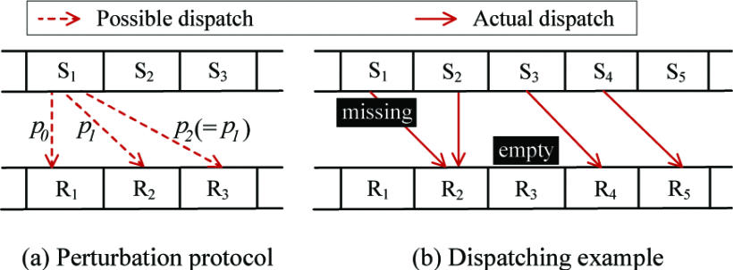

---

<!-- footer: "Methodology" -->

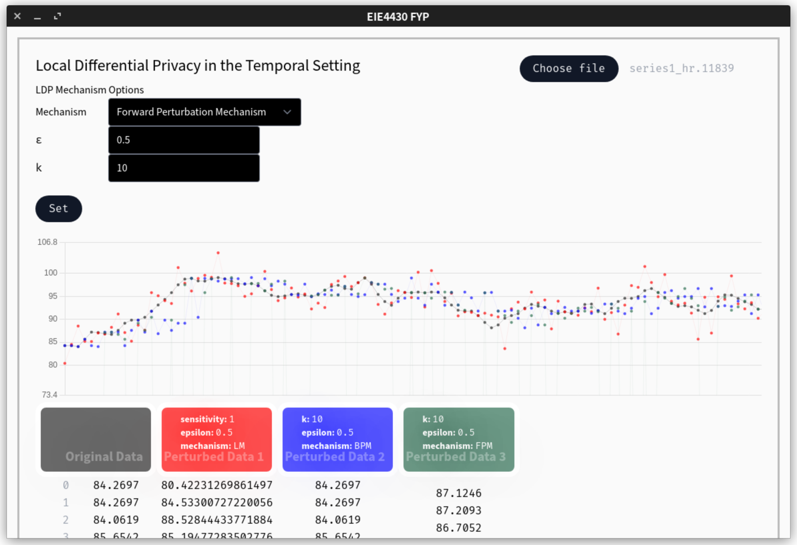

---
# Development Stack
| Tool             | Description             |
| ---------------- | ----------------------- |
| **Node.Js**      | runtime environment     |
| **Electron**     | application framework   |
| **React**        | building user interface |
| **Tailwind CSS** | styling                 |
| **Chart.js**     | creating charts         |

---
# User Interface
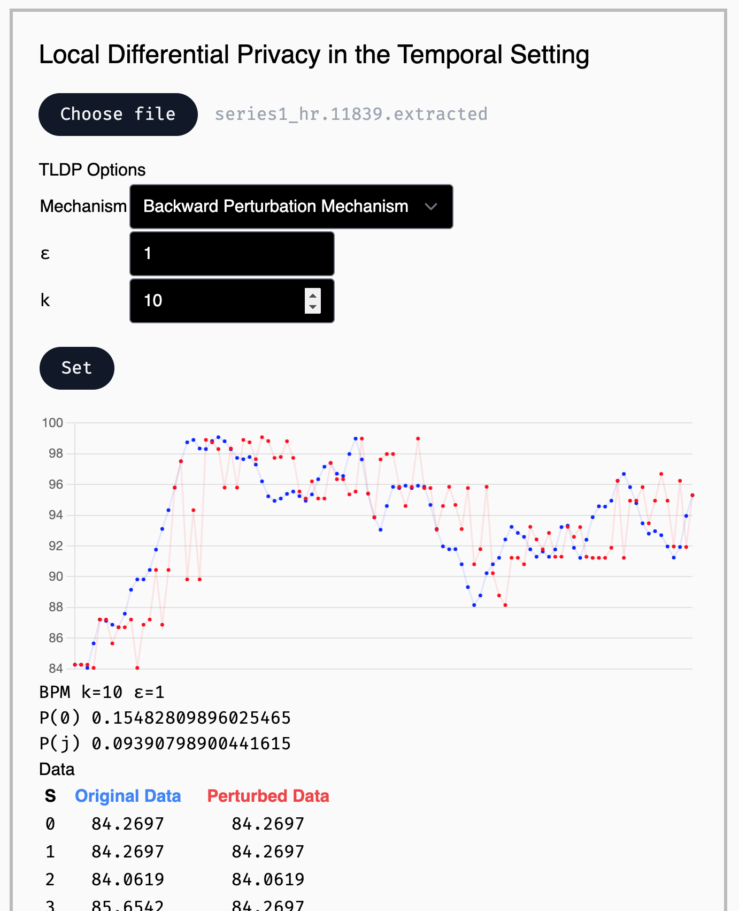 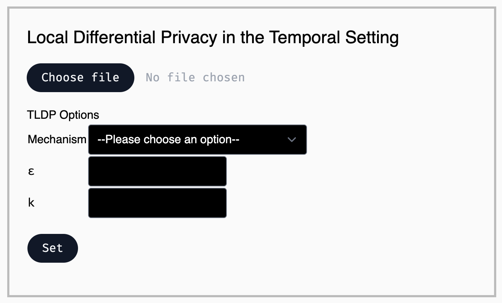 

---
# Data and parameter inputs
- a text file with the format of each datum at a line

---
# Data and parameter inputs
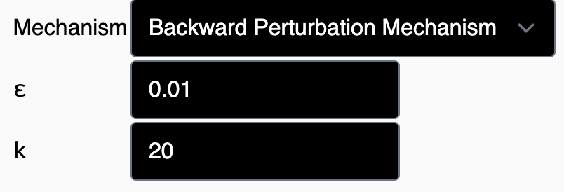

---
# Chart Presentation
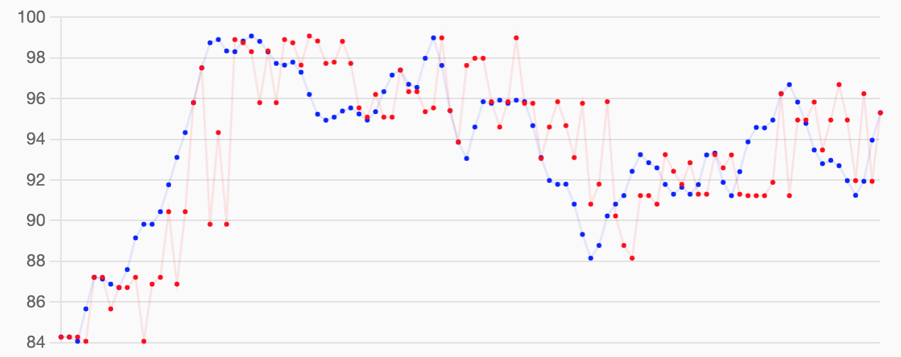

---
# Data List

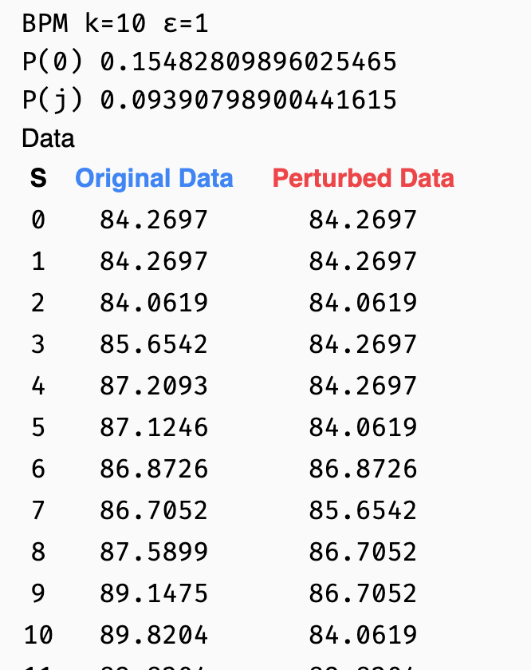

---
<!-- footer: "Evaluation" -->
# Data Sources
- Heart rate time series from MIT-BIH Database Distribution
- Datasets from UC Irvine Machine Learning Repository
---
# VLDP vs TLDP

- Green: Backward Perturbation Mechanism
  - $\epsilon = 0.5, k = 10$
- Red: Laplace Mechanism
  -  $\epsilon = 0.5, \text{sensitivity} = 1$
---
# Privacy Budget $\epsilon$
- indicates the degree of privacy preserved 
after the perturbation is implemented
- lower value of introduces more randomization
- resulting dataset would be more different from original dataset
- better privacy preservation
---
<!-- _footer: "" -->

$\epsilon = 1$
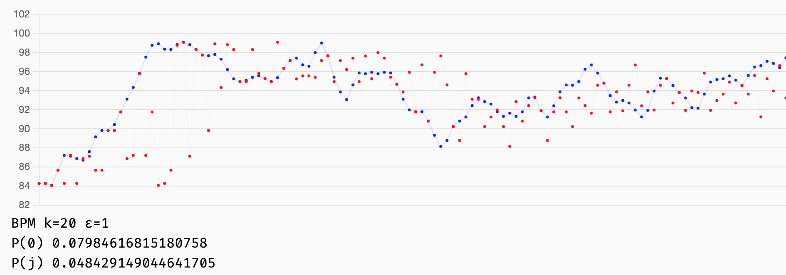
$\epsilon = 5$
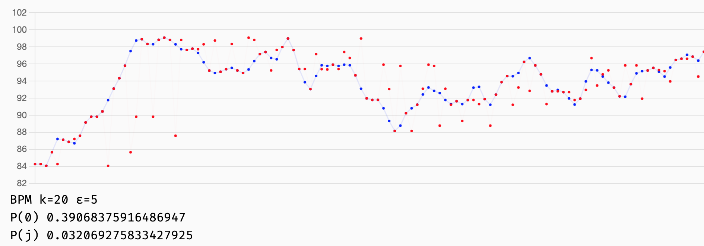

---
<!-- _footer: "" -->
$\epsilon = 10$
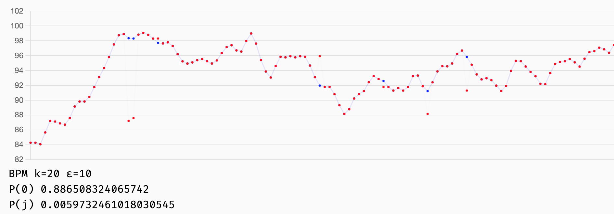
$\epsilon = 15$
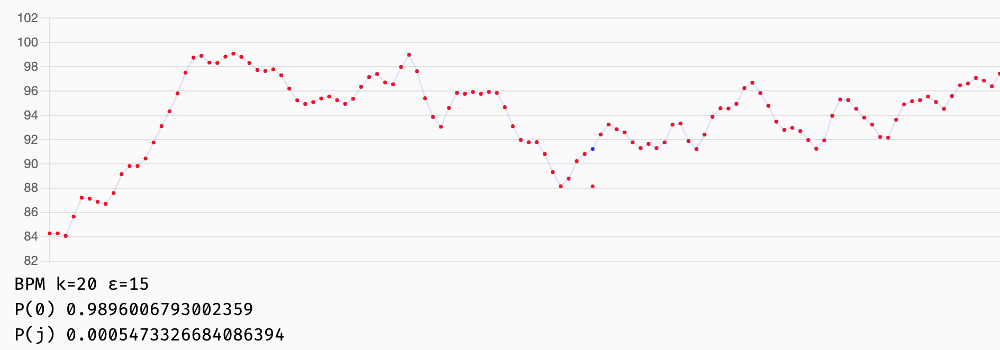

---

# Window size $k$

---
<!-- footer: "Project Implementation" -->
# Project Schedule
| Project Task / Milestone             |      Date       |  Status  |
| ------------------------------------ | :-------------: | :------: |
| Project Planning                     | 1 Sep - 15 Sep  | Finished |
| Research and Analysis                | 1 Sep – 28 Nov  | Finished |
| Project Proposal                     |     15 Sep      | Finished |
| Software Development                 | 29 Nov - 28 Feb |   WIP    |
| Implementation of TLDP algorithm     | 3 Jan - 28 Feb  |   WIP    |
| Interim Report                       |     28 Dec      | Finished |
| Interim Project Presentation         |      6 Jan      |
| System Evaluation                    | 1 Feb - 27 Mar  |
| Preparation of Final Project         | 28 Mar - 10 Apr |
| Final Project Report                 |     11 Apr      |
| Preparation of Final Presentation    | 12 Apr - 19 Apr |
| Final Presentation                   |     20 Apr      |
| Preparation of Project Demonstration | 21 Apr - 10 May |
| Project Demonstration                |     11 May      |
---

# Proposed Future Work
- Implementation of Threshold Mechanism
  - Threshold Mechanism with targeted $\epsilon$
  - Extended Threshold Mechanism

- Data analysis of the perturbed data
  - to observe the data utilization after implementing
TLDP

- Improvement on the User Interface
    - manipulating the LDP settings
    - enhance the graphical representation of data

---
<!-- footer: "References" -->
# References
[wip]

---
<!-- footer: "The end &emsp; Q&A" -->
# Thank you
## Questions are welcomed!
